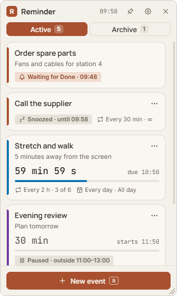
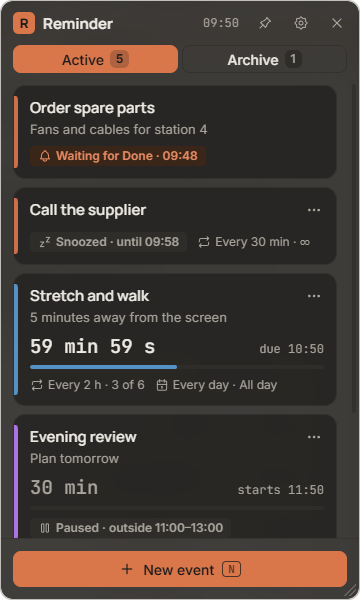
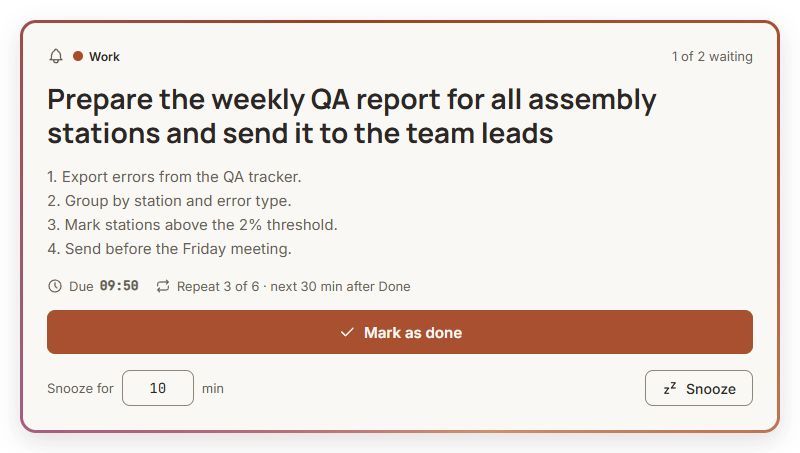
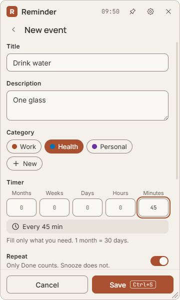
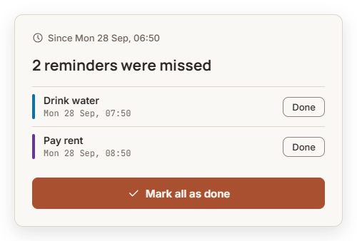

# Reminder

**A small always-on-top reminder for Windows. Every task gets its own timer and working hours, and when it is due, a card appears in the middle of the screen and stays there until you react.**

[Русская версия](README.ru.md)

<p>
  
  
</p>

## Why

Regular small tasks are easy to forget when you are deep in work: drink water, stretch, check a tracker, send a weekly report, pay rent. Calendar pop-ups disappear after a few seconds and phone notifications get swiped away.

Reminder keeps a semi-transparent window on top of your other windows with a live countdown for each task. When a timer runs out, a card appears in the centre of the main screen. It cannot be closed. It only goes away when you press **Mark as done** or **Snooze**, so nothing slips through.

It is built for a working day:

- short timers only run inside your working hours and on the days you choose;
- if the PC was asleep or switched off, you get a summary of what you missed.

## Features

- **Per-event timers** made of months, weeks, days, hours and minutes (1 month = 30 days).
- **Repeat** a set number of times or until you stop it. Only *Done* counts towards the total; *Snooze* does not. After the last *Done* the event moves to the archive.
- **Active hours and days** for each event (for example Mon–Fri 07:30–16:00, or all day):
  - timers under 1 day pause outside these hours and restart from the full interval when the hours begin;
  - timers of 1 day or more count calendar time, and if one is due outside hours, it waits for the next start.
- **Notification in the centre of the screen**:
  - it sits above all windows and cannot be closed or minimised;
  - it grows with long text and shows events that fired at the same time one by one, oldest first;
  - it plays a sound: the system sound or your own MP3, WAV or OGG file.
- **Missed summary** after sleep or shutdown: each missed event appears once, with *Done* per row and *Mark all as done*.
- **Categories** with colours; three default ones (Work, Health, Personal), up to 20.
- **Archive** with two ways back: keep the previous timer, or set a new one.
- **Window**:
  - frameless and semi-transparent, with an adjustable blurred background (40–100 %);
  - always on top, resizable from any edge, position lock (pin);
  - click-through mode;
  - hides to the tray and starts with Windows if you want.
- **Three themes**: Ivory, Clay and Graphite. Keyboard shortcuts and reduced-motion support.
- **Private by design**: no account, no internet access, no telemetry. Your data stays in one file on your PC.

<p>
  
</p>
<p>
  
  
</p>

## Requirements

- Windows 10 (version 2004 or newer) or Windows 11, 64-bit.

## Installation

1. Download `Reminder Setup x.y.z.exe` from [Releases](https://github.com/FLAIR-soft/Simple_Reminder/releases), or build it yourself (see [Development](#development)).
2. Run the installer. The installer is not code-signed, so Windows SmartScreen may show a blue warning. Click **More info → Run anyway**.
3. Choose the folder and finish. Reminder starts and appears in the top right corner of the screen, with an icon in the tray.

To update, install a newer version over the old one; your events are kept. To uninstall, use **Settings → Apps** in Windows. Your data file is left in place, so a later reinstall picks it up again.

## How to use

### Create an event

1. Press **New event** or the `N` key.
2. Enter a **title** and, if you like, a **description** and a **category**.
3. Fill the **timer**. Only the fields you need, for example `Hours 2` or `Minutes 45`. The summary below the fields shows the result, for example *Every 2 h*.
4. **Repeat**:
   - off: a one-off reminder that goes to the archive after *Done*;
   - on: enter how many times, or choose **Until I stop**.
5. **Active hours**: choose **All day** or set the hours (24-hour format, for example `07:30`–`16:00`), then pick the days.
6. Press **Save** or `Ctrl+S`.

If a short timer does not fit into the active hours (for example 2 h in a 1-hour window), the form explains why and does not save.

### The main window

- **Active** shows every running event with a countdown, a progress bar, the repeat count and its schedule. Events waiting for your *Done* are at the top.
- **Archive** shows finished events and events you moved there yourself.
- The **⋯** menu on a card has **Edit** (`E`), **Move to archive** and **Delete**. Delete needs you to **hold the button for about a second**, so a slip of the mouse cannot remove anything.
- In the archive, **⋯ → Restore** gives two choices:
  - *Keep previous timer*: the old settings, with the repeat counter back to zero;
  - *Set new timer*: opens the form.

### When a reminder fires

A card appears in the centre of the main screen:

- **Mark as done**: counts as one repeat. The next cycle starts from this moment.
- **Snooze for N min**: the reminder comes back after that many minutes (1–1440; the default is set in Settings). Snooze does not count as a repeat.

If several events fire at once, they are shown one by one (*1 of 3 waiting*). Other timers keep running while a card is open. A waiting event stays until you react, even after its working hours end.

### After sleep or shutdown

When you start the PC again, a summary shows what was due while it was off. Press **Done** per row or **Mark all as done**. Regular notifications wait until the summary is closed.

### Settings

Open them with the gear icon.

| Setting | What it does |
|---|---|
| Theme | Ivory, Clay or Graphite |
| Window opacity | 40–100 %; only the background changes, text and buttons stay sharp |
| Blur the background | Blurs what is behind the window. While on, Reminder is hidden from screenshots and screen sharing, so turn it off if you want to show the window in a call |
| Always on top | Keeps the window above other windows |
| Lock position | Same as the pin button: the window cannot be moved or resized |
| Click-through | Mouse clicks pass through the window. **It can only be turned off from the tray**: right-click the Reminder icon and uncheck *Click-through* |
| Start with Windows | Starts Reminder hidden in the tray when you log in |
| Sound | System sound or your own MP3, WAV or OGG file (up to 10 MB), with a play button to test it |
| Default snooze | Minutes pre-filled in the notification |
| Categories | Rename, recolour, add or delete (only empty categories can be deleted) |

### Tray menu

Right-click the tray icon: **Show Reminder**, **New event**, **Always on top**, **Click-through**, **Start with Windows**, **Quit**.

The **×** in the window only hides it to the tray; timers keep running. To exit completely, use **Quit** in the tray.

### Keyboard

| Key | Action |
|---|---|
| `N` | New event |
| `E` | Edit the selected event |
| `Ctrl+S` | Save the form |
| `Esc` | Close a menu, go back, cancel the form |

Single-letter shortcuts never fire while you are typing in a field.

## Your data

- Everything is stored in `%APPDATA%\Reminder\reminder-data.json`.
- Every save is atomic, and the previous version is kept as `reminder-data.json.bak`.
- If the file is damaged, the app shows a banner with **Retry** and saves nothing until the problem is solved. **Start fresh** keeps the broken file next to the new one; it is never deleted.
- The app makes no network requests.
- For the blurred background, the app watches the screen under its own window as a live, low-resolution video. The picture only exists in memory. It is never recorded, saved or sent anywhere. Turn the blur off to stop it.

## Development

Stack: Electron, Vite (electron-vite), React, TypeScript (strict), zod, i18next, Tabler Icons, Vitest and Playwright.

```bash
npm install
npm run dev         # start with hot reload
npm test            # unit tests (scheduler, storage), TZ=Europe/Berlin
npm run test:e2e    # build + end-to-end tests on the real app (Playwright _electron)
npm run typecheck
npm run dist        # typecheck, build and create the NSIS installer in release/
```

Project layout:

```
src/shared/     model (zod schemas), time maths, scheduler: pure functions (state, now) → state
src/main/       windows, tray, storage, IPC with validation, blur, security
src/preload/    typed bridge exposed as window.reminder
src/renderer/   React UI: main window, notification, missed summary
tests/unit/     scheduler and storage tests (DST, clock changes, sleep, queues…)
tests/e2e/      Playwright tests on the built app
docs/           plan, launch checklist, stress-test and security-audit reports
```

Security:

- the renderer runs sandboxed, with context isolation and no Node access;
- every IPC call is checked by schema and sender;
- a strict Content Security Policy is applied;
- navigation, new windows and all permissions are blocked, except the video-only screen stream for the blur;
- Electron fuses are hardened in the build.

Details are in [docs/security-audit.md](docs/security-audit.md).
